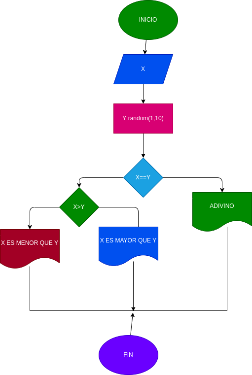

# programa para adivinar un numero entre 1 ,10
calcular si X es mayor que Y  o si X  es menor que Y

# ANALSIS
variables de entrada
X = digite numero a ingresar
Y = un numero al azar entre 1 y 10

variables de proceso y salida
X  es menor que Y
X es mayor que Y
ADIVINO

# DISEÑO
